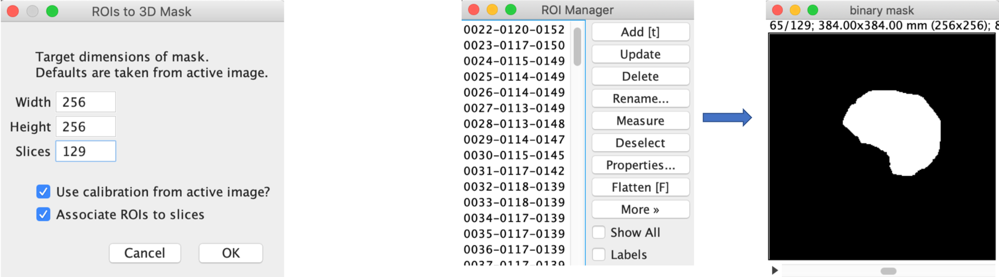

# SegTools

### TODO Collection
* TODO: add a classnotfound catch in the source code? in case morpholibj is not installed?
* ROI manager to mask: when not asociated to slices: draw into every slice. keep consistent with the other plugins
* TODO: add the checkbox option to whether or not associate with slices
* update screenshot gui below.
* add a link to this repo in the plugin GUIs or an "about" section
* are the plugins macro-recordable? add a comment below
* ToDo update all menupaths once moving to scf update site
* Update the update site instructions once moving to the scf update site
* add a category: ### Author or something like this -> SCF
* make images of this readme into right size
* update plugin names: ROI Manager isntead of ROI Manager
* Important: ROI manager to Mask: don't crash if no image is open!
* Important: Create overlay: There can be an infinite loop?! in the installed Fiji_dev
* Create overlay is not macro recordable

## About

Segtools is a collection of small utility plugins for 3D segmentation in ImageJ/Fiji. They provide functionality for:
* Semi-manual segmentation (3D)
* Conversion of ROIs in the ROI manager to a 3D binary mask
* Back-conversion from a 3D binary mask to a list of ROIs in the ROI manager
* Visualization of a 3D segmentation as image overlay


The plugins are being developed at the [**Scientific Computing Facility of the MPI-CBG Dresden**](https://www.mpi-cbg.de/services-facilities/core-facilities/scientific-computing-facility/service-portfolio-overview/).

## Installation
* **SegTools** is distributed via an **Update site** in **Fiji**. To add it, open Fiji, then click the Menu `Help > Update ..., then XXXX TODO`. Then restart Fiji.
* Some of the plugins depend on the [**MorpholibJ**](https://imagej.net/MorphoLibJ) library. 
	* Note that MorpholibJ is distributed under the [GNU Lesser General Public License (LGPL)](https://github.com/ijpb/MorphoLibJ/blob/master/LICENSE.txt).
	* To add this library to your Fiji: Click `Help > Update ... > ` select `IJPB-plugins > ` then select `Close > Apply Changes`. Then restart Fiji.
* For general instructions on how to follow an update site, check [here](https://imagej.net/Following_an_update_site).


## Plugin Descriptions

### Semi-manual Segmentation (3D)
Menu path: `Plugins > SegTools > Semi-manual Segmentation (3D)`

This plugin is a thin wrapper around existing Fiji functionality to do semi-manual segmentation of a single 3D object. The user manually draws ROIs into several image slices. The ROIs are interpolated (built-in Fiji functionality). A 3D binary mask of the object is created and the volume of the region is then computed (using MorpholibJ).

**Example use case**: You want to measure the volume of a 3-dimensional region which cannot be (easily) segmented automatically.


#### Usage
Open a 3D image and start the plugin. A window with instructions will appear (**don't press OK just yet!**). 


GUI options:
* **Add overlay**: Adds an overlay of the created segmentation mask to the original image.
* **Compute statistics (MorpholibJ)**. Computes the (calibrated) volume and other statistics, using the [`Analyze Regions 3D`](https://imagej.net/MorphoLibJ#Region_Analysis_3D) plugin of MorpholibJ.

Follow the instructions given in the GUI:
* Choose for example the `Freehand` tool, then draw a **ROI** into a slice, add it to the ROI manager. Repeat this for **multiple slices**. Make sure to draw ROIs into the first and last slice of an object and every time that the objects shape changed quite a bit from the previous ROI.
* It can be a good idea to save the ROIs before continuing (`ROIManager > More > Save...`).
* When done with drawing, right click into the ROI list, and select **`Interpolate ROIs`**.
* Verify that the outline of the shape is good in all slices, otherwise correct it (for example with the `Brush` tool. Then don't forget to `Update` the ROI in the manager).


Press `OK` to finish, and the plugin creates a **3D binary mask** and, if chosen, computes **statistics**.


<br/>

### Mask (3D) to ROI Manager ROIs
Menu path: `Plugins > SegTools > Mask (3D) to ROI Manager ROIs`

This plugin converts a binary 3D (or 2D) mask into a list of ROIs in the ROI manager. The ROIs are associated with slices. The ROI manager is cleared before adding the new ROIs.


<br/>


### ROI Manager ROIs to Mask (3D)
Menu path: `Plugins > SegTools > ROI Manager ROIs to Mask (3D)`

This plugin creates a 3D binary mask from all ROIs stored in the ROIManager. The plugin works also in 2D but is then equivalent to  `Edit > Selection > Create Mask`.

#### Usage
Create one or more ROIs and add to the ROI Manager. In 3D, ROIs are typically associated with specific slices. Then start the plugin.

GUI options:
* **Target dimensions**: Size of the mask that will be created. Should be the same size as the grayscale image to which the mask belongs. If an image is open, the default size is taken from the active image.
* **Use calibration from active image**: If checked, then copies the calibration information from the current active image.
* **Associate ROIs to slices**: If checked, then each ROI is drawn into its associated slice, otherwise it is drawn into all slices.<br/>
Examples:
	* Keep checked if the ROIs correspond to an actual 3D shape.
	* Uncheck if you want to repeat a single ROI in all slices.



<br/>

### Create Overlay of Segmentation (3D)
Menu path: `Plugins > SegTools > Create Overlay of Segmentation (3D)`

Creates an overlay of a 3D (or 2D) segmentation mask onto another grayscale image. This is useful to visualize the segmentation.

#### Usage
Open a segmentation image and the corresponding raw grayscale image. The segmentation image is either binary (foreground/background) or contains labelled regions (each region has a different value 1,2,3,.... This can for example be created from a binary image with the Connected Component Labeling plugin by MorpholibJ). Then start the plugin.


GUI options:
* **segmentation image**: Either binary or labelled regions (see above).
* **grayscale image**: The corresponding raw image onto which the overlay is added. Must have same width, height and slices as the segmentation image. Can have multiple channels.
* **color mode**: In which color to draw the overlay. If the segmentation image is a label image, then individual regions can optionally be drawn in different colors ("multicolor" mode). Otherwise, the overlay is always drawn in a single color.


## Macros and Scripting TODO

#### Macros
Convert ROIs to a binary mask:
```
run("Mask (3D) to ROIManager ROIs");
```
Convert binary mask to ROIs:
```
run("ROIManager ROIs to Mask (3D)", "width=256 height=256 slices=129 use");
```

TODO: Create overlay is not macro-recordable! Nor is the semi-manual segmentation (but less important)


#### Scripting languages TODO more examples
The plugins can be recorded similar to the macro language. But for scripting languages it can be more useful to directly use the Conversions [TODO link] class (a collection of static utility functions) to convert between ROIs and binary masks.
```python
from ij import IJ 
from de.mpicbg.scf.segtools import Conversions #TODO update when package is updated

mask=IJ.getImage(); # binary mask

roiArray=Conversions.RoisFromBinaryMask(mask) # array of rois
```
